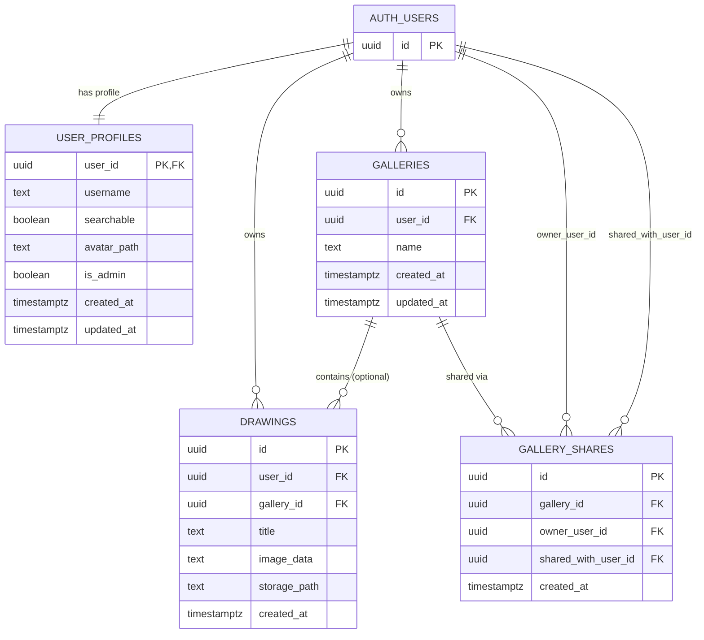

# The Special Art Gallery

A multi-page drawing web app where users can create digital art on a canvas, organize drawings into galleries, and share galleries with other users.

## Project Description

The Special Art Gallery supports three user modes:

- **Guest mode**
  - Can draw on canvas
  - Can use core tools and download images
  - Cannot save drawings, manage galleries, or share
- **User mode (authenticated)**
  - Can save drawings to Supabase
  - Can create/edit/delete galleries
  - Can move drawings in/out of galleries
  - Can share galleries with specific users
  - Can set profile discoverability (searchable/private)
  - Can edit username and profile picture
- **Admin mode**
  - Can view and manage all users, galleries, and drawings
  - Can update profile visibility/admin status
  - Can perform cross-user moderation operations from admin dashboard

## Architecture

### Frontend

- **Stack:** HTML, CSS, JavaScript, Bootstrap 5, Bootstrap Icons
- **Build tooling:** Vite (multi-page input configuration)
- **Pages:**
  - `index.html` – landing/home page
  - `draw.html` – drawing canvas and save/download/upload flow
  - `login.html` / `register.html` – auth flows
  - `profile.html` – personal profile, gallery management, sharing, admin dashboard view

Frontend behavior is split into modular ES modules under `src/js/`:
- auth/session handling
- drawing logic + history + storage
- profile (personal + admin) logic
- shared toast/UX behaviors

### Backend

- **Platform:** Supabase
- **Auth:** Supabase Auth (email/password)
- **Database:** PostgreSQL with Row-Level Security (RLS)
- **Storage buckets:**
  - `drawings` (private object storage for saved drawings)
  - `profile-pictures` (private object storage for avatars)

### Security Model (RLS)

- Users can manage their own drawings/galleries/profile data.
- Shared-gallery recipients can read shared galleries/drawings.
- Profile search respects `searchable` privacy toggle.
- Admins are resolved through `user_profiles.is_admin` and `public.is_admin(...)` policy checks.
- Storage object policies mirror DB access model (owner/shared/admin).

## Database Schema Design

Schema derived from Supabase migrations in `supabase/migrations/` and validated via MCP table inspection.



### Main Tables Summary

- `public.user_profiles`
  - Extends auth users with username, privacy/searchability, avatar path, and admin flag.
- `public.galleries`
  - User-owned containers for drawings.
- `public.drawings`
  - Saved artwork metadata and image references (`image_data` legacy + `storage_path` for bucket object path).
- `public.gallery_shares`
  - Join-style sharing table for gallery access by specific users.

## Local Development Setup Guide

### Prerequisites

- Node.js 18+
- npm
- A Supabase project (or local Supabase stack)

### 1) Clone and install dependencies

```bash
npm install
```

### 2) Configure environment variables

Create `.env` in project root:

```env
VITE_SUPABASE_URL=your_supabase_project_url
VITE_SUPABASE_PUBLISHABLE_KEY=your_publishable_key
# Optional fallback if publishable key is not used:
# VITE_SUPABASE_ANON_KEY=your_anon_key
```

> The app reads `VITE_SUPABASE_PUBLISHABLE_KEY` first, then falls back to `VITE_SUPABASE_ANON_KEY`.

### 3) Apply database migrations

Run migrations in order from:

- `supabase/migrations/2026-03-01T00-00-00-create-drawings-table.sql`
- `supabase/migrations/2026-03-01T01-00-00-enable-storage-for-drawings.sql`
- `supabase/migrations/2026-03-02T00-00-00-create-galleries-table.sql`
- `supabase/migrations/2026-03-02T00-10-00-fix-gallery-function-search-path.sql`
- `supabase/migrations/2026-03-02T02-00-00-add-privacy-and-gallery-sharing.sql`
- `supabase/migrations/2026-03-02T03-00-00-add-profile-pictures.sql`
- `supabase/migrations/2026-03-03T00-00-00-add-admin-role-and-policies.sql`

You can apply these using Supabase CLI, SQL editor, or MCP migration tooling.

### 4) Start the app

```bash
npm run dev
```

Then open the local Vite URL (typically `http://localhost:5173`).

### 5) Production build (optional)

```bash
npm run build
npm run preview
```

## Key Folders and Files

### Root

- `index.html` – landing page
- `draw.html` – drawing workspace page
- `login.html`, `register.html` – authentication pages
- `profile.html` – profile + gallery + admin dashboard page
- `vite.config.js` – Vite multi-page entry configuration
- `package.json` – scripts and dependencies

### Frontend source (`src/`)

- `src/css/style.css` – shared visual styling/theme
- `src/js/main.js` – shared bootstrap logic (toasts, navbar auth state, auth forms)
- `src/js/supabaseClient.js` – Supabase client initialization + remember-me storage strategy
- `src/js/auth.js` – auth helper functions (sign up, sign in, sign out, current user)
- `src/js/draw.js` – drawing page entrypoint
- `src/js/profile.js` – profile page entrypoint

#### Drawing module

- `src/js/draw/page.js` – canvas interactions, tool behavior, upload/download/save orchestration
- `src/js/draw/history.js` – undo/redo history stack logic
- `src/js/draw/storage.js` – drawing persistence and loading with Supabase

#### Profile module

- `src/js/profile/page.js` – profile page composition + module wiring
- `src/js/profile/personal.js` – personal profile feature orchestration
- `src/js/profile/admin.js` – admin dashboard behaviors and moderation actions
- `src/js/profile/personal/` – focused submodules:
  - `drawings.js` – drawing list operations
  - `galleries.js` – gallery CRUD operations
  - `sharing.js` – user search and gallery sharing flow
  - `profileData.js`, `profileEdits.js`, `renderingEvents.js` – profile data loading/editing/render/event binding

### Backend schema

- `supabase/migrations/` – source-of-truth SQL migrations for schema, storage, and RLS policies

## Notes

- This project is built as a modular multi-page app rather than a SPA.
- New database changes should be added as **new migration files** (do not edit existing migrations).
- The app supports both saved drawings in storage and privacy-aware collaboration via gallery sharing.
